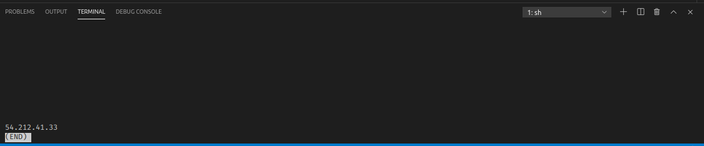

# Private-VPN

Setting up a Private VPN on Amazon AWS Cloud using CloudFormation

## Requirements

- AWS Account
- AWS Cli

## How to setup VPN

- Configure aws cli on local computer using:

```
aws configure
```

**Note:** Set default region to `us-west-2`

- In `pptp.json` file change `ParameterValue` of `VPNUsername` and `VPNPassword`

* Run `create.sh` bash script using:

```
./create.sh <stack-name> pptp.yaml pptp.json
```

**You will get stack id in response if everything went right**

**Note:** Replace `<stack-name>` with name of your choice `ex: ./create.sh vpn pptp.yaml pptp.json`

**Note:** If permission denied run `chmod +x create.sh` and then `./create.sh vpn pptp.yaml pptp.json`

**Wait for a minute or two for AWS EC2 instance to setup**

- Run `getIp.sh` to get the ip address of the EC2 instance

```
./getIp.sh <stack-name>
```

**Note:** Replace `<stack-name>` with the name of stack `ex: ./getIp.sh vpn`

**Note:** If permission denied run `chmod +x getIp.sh` and then `./getIp.sh vpn`



**This will be your ip address. Copy this Ip Adress and setup VPN on your device and use this Ip address as gateway. Username and Password will be what use used in the pptp.json file while replacing the parameters.**
**Default Username: user1234 and Password: pass1235**

- To delete the server run `delete.sh`

```
./delete.sh <stack-name>
```

**Note:** Replace `<stack-name>` with the name of stack `ex: ./delete.sh vpn`

**Note:** If permission denied run `chmod +x delete.sh` and then `./delete.sh vpn`

**Note:** AWS provide `750 hours per month of EC2` in its free tier so you won't occur charges as long as you dont exceed 750 hours. If you use more than one EC2 instance it is recommended to delete the EC2 instance when not using it. Although you have to set VPN connection on your pc everytime if you delete server as the Ip Address will change.

`Also for the first time do verify that stack has been deleted successfully using AWS Console and going to CloudFormation.`
